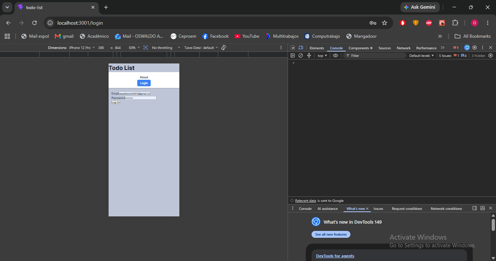
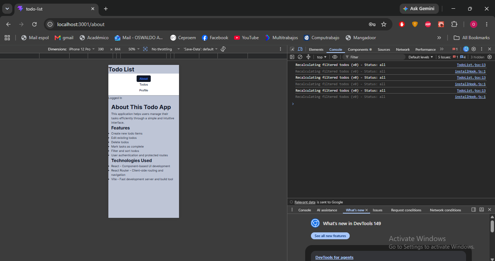
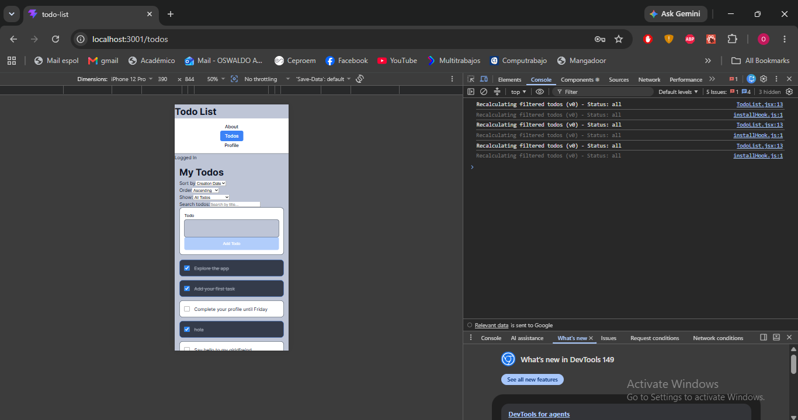
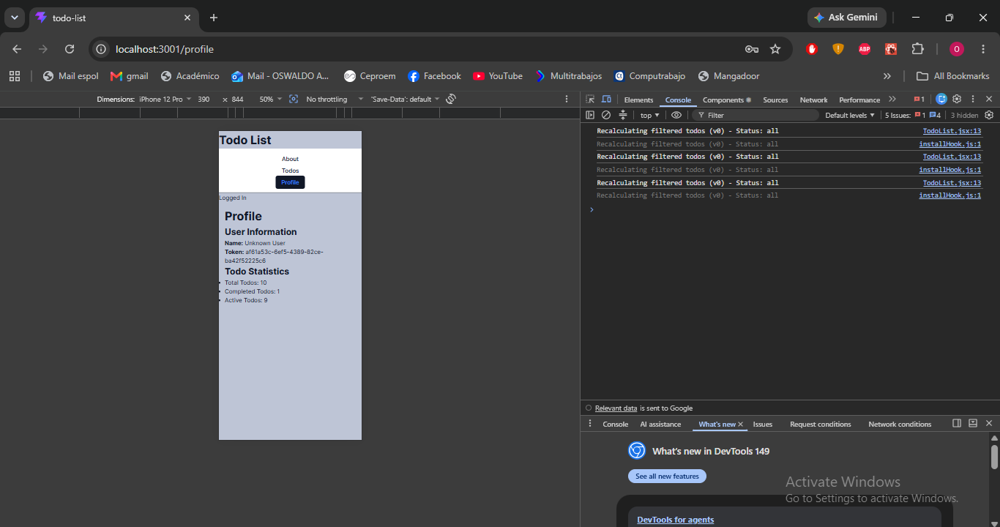

# CTD  - React TODO-LIST Application

This application helps users manage their tasks efficiently through a simple and intuitive interface.

## 🚀 Live Demo
[View Live Application] NA

## 📸 Screenshots





## 📸 Presentation
https://drive.google.com/file/d/1st_FIzhjuAZX4_l7y940YlcaMudJa5VD/view?usp=sharing

## 🛠️ Technologies Used
    React - Component-based UI development
    React Router - Client-side routing and navigation
    Vite - Fast development server and build tool

## ✨ Features
    Create new todo items
    Edit existing todos
    Delete todos
    Mark tasks as complete
    Filter and sort todos
    User authentication and protected routes

## 🏗️ Installation & Setup

1. Clone the repository:
   ```bash
   git clone https://github.com/Oswaldo-O/todo-list
   
   ```

2. Install dependencies:

   ```bash
   npm install
   ```

3. Start the development server:

   ```bash
   npm run dev
   ```

4. Open [http://localhost:3001](http://localhost:3001/) in your browser
